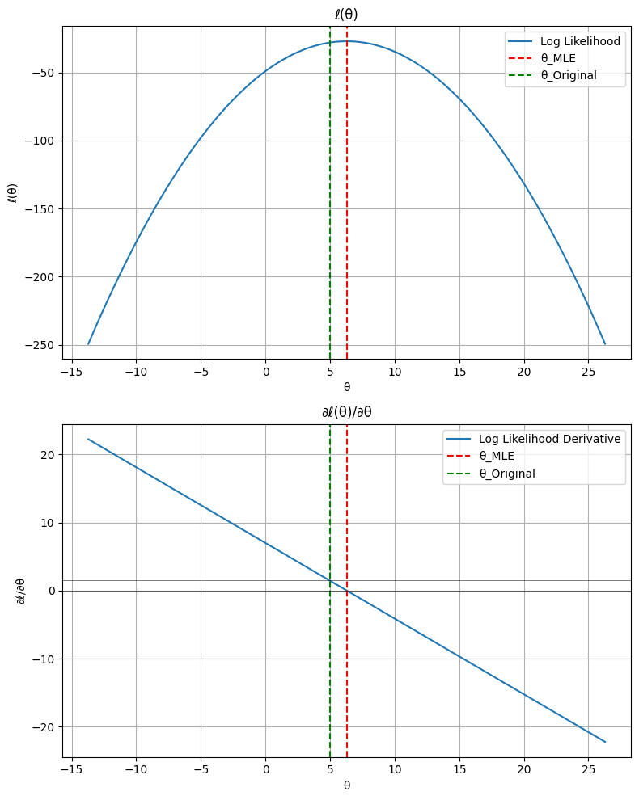
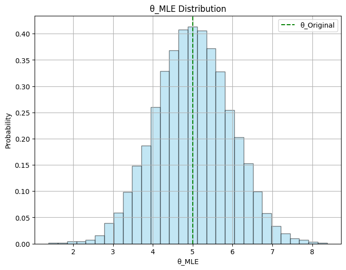

# Maximum Likelihood Estimator: Simulation and Analysis

## Intro
Maximum Likelihood Estimator (MLE) is a parameter estimation method for statistical models given a set of observed data. It is well-documented that the MLE approach provides highly accurate unbiased estimations. This repository aims to discuss the accuracy of MLE by comparing MLE values from synthetic data samples, created using known parameter values of an example density distribution, and present theoretical grounding in sequence.

## MLE Theory
The likelihood function expresses the joint probability for observed data as a function involving parameters within a statistical probability distribution model. The likelihood measurement idea is not about finding the true parameter values, that is, values that generate the samples of observed data, but which parameter values are more consistent to represent the given sample. So, higher the likelihood is, more consistent the parameters are. For this reason, the extreme maximum of the likelihood function is the mathematical definition for Maximum Likelihood Estimators.
It is indeed strange that the likelihood idea is not about finding the true parameter values, as it is the main goal from the start, but it is important to remember that most of the real data are samples from a population, therefore finding the true parameter values is not a feasible goal. However, as MLE depends on sample data, it also has its own distribution, with expected value and variance. The good news is that MLE expected values are often the true values and it is what is going to be shown in the simulations.
A fundamental caveat must be made beforehand. There are certain conditions to be observed in order to apply these concepts. They will not be explored further in this text, but, for instance, the data must be independent and identically distributed and the likelihood function must be continuous in respect to the parameters. In resume, these conditions are related to the viability of using MLE.

## Simulation and Results
Picking up a simple example of Normal Distribution $`N(θ^*,{σ^*}^2)`$, the MLE for $`θ`$, or $`θ_{MLE}`$, is:
$$θ_{MLE} = \frac{1}{n}\sum_{i=1}^n x_i = x̄$$
Considering mean $`θ^* = 5.0`$ and standard deviation $`σ = 3.0`$, a sample of length 10 is generated and its $`θ_{MLE}`$ is calculated according to the previous formula.

There are two plots in this image, the first (upper) shows the log likelihood function against θ and the second shows the derivative of the log likelihood against θ. The green dashed line represents $`θ^*`$, the true distribution parameter, while the red dashed line represents $`θ_{MLE}`$ for the subject sample. Remember, $`θ_{MLE}`$ is the parameter value whose log likelihood is minimum (or likelihood is maximum). As discussed before, $`θ_{MLE} \ne θ^*`$, therefore $`∂ℓ(θ^*)/∂θ \ne 0`$. This difference between these values can be verified by observing the couple of black horizontal lines shown in the derivative plot.
As $`θ_{MLE}`$ is a random variable, if a large number of samples are avaiable, it is possible to approximate $`E[θ_{MLE}]`$. Running the same experiment 10,000 times:

This image is a plot of probability against $`θ_{MLE}`$. Among the 10,000 random samples, the highest probability for $`θ_{MLE}`$ is $`θ^*`$, that is $`E[θ_{MLE}] ≈ θ^*`$. It is also important to observe that the result $`θ_{MLE}`$ distribution is approximately Gaussian.
In short, it is intuitive that when the number of samples tends to infinity, $`θ_{MLE}`$ has a $`N(θ^*,σ^2)`$ distribution. This is a very interesting result, because, despite of the likelihood function maximum does not matches the true parameter value, the distribution of MLE is centered in the true parameter value.

## Theoretical Proof
The conclusion achieved in simulations is not exclusive to the example. According to the Central Limit Theorem, increasing sample size tends to have a sample mean approximately Gaussian. From the Law of Large Numbers, the mean of a large number of samples tends to matches the true value. Therefore, it is expected that $`θ_{MLE}`$ has a $`N(θ^*,σ^2)`$ distribution and, consequently, $`E[∂ℓ(θ^*)/∂θ] = 0`$.

## Final Considerations
The simulations and theory substantiate the potential of MLE in estimating unbiased parameters within statistical models. While the calculated MLE value might not perfectly align with the true parameter in individual instances, the convergence observed across numerous random samples offers evidence of its capability to approximate the true parameter value. This becomes particularly remarkable when approximating the expected value of MLE, demonstrating a consistent trend of convergence towards the true parameter values as the sample size increases.
